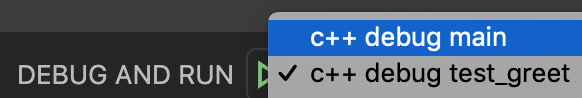

# DevContainer demo

This is a project demoing the use of DevContainers for a C++ student programming assignment project.

The source code can be built using make. Executables will be placed under the build directory.

## Getting Started with the Devcontainer
- ⚠️NOTE: Windows users, when installing Docker it may ask you if you want to configure it for running Windows containers or Linux containers. Choose Linux containers.
- ⚠️NOTE: Windows users, if you are running Windows Home edition, first read the note below the next item!
- Download and install Docker Desktop: https://www.docker.com/products/docker-desktop
  - ⚠️NOTE: Docker Desktop for Windows requires the Hyper-V Windows feature which is not available on Home-edition. If you are running Windows Home-edition, install Docker Toolbox instead: https://docs.docker.com/toolbox/toolbox_install_windows/
- Make sure docker is running
- Download and install VSCode
- Open VSCode, click the "Extensions" icon on the left and install the "Remote Development" extension by Microsoft
 
- Open this project in VSCode
- There will be a popup asking if you want to open it in a devcontainer:

- Click "Reopen in Container"
- If you don't see the popup, you can also open the devcontainer with a command. 
  - open the Command Palette in VSCode: `ctrl+shift+p` (`cmd+shift+p on mac`)
  - type "reopen" and hit enter
  
- The first time you are opening the devcontainer it will take a couple of minutes to install. But if you reopen it again at a later moment it should only take a matter of seconds.
- Once the devcontainer is up and running you'll see the files in your project reappear on the left
- Open bash in the VSCode Terminal tab:

  - ℹ️If you don't see a TERMINAL tab in the bottom panel of your screen, hit ``ctrl+` ``
  - ℹ️If you don't see a "Bash" option in the dropdown, click the plus icon to the right of the dropdown
- Cool, now you are fully set up to begin developing on the project!

# Building (Compiling And Running Executables)
- This project uses the `make` build system
- To compile source files you can run: `make` or `make build_test` in the terminal.
- A folder with the name "build" has now appeared in your project. You can find the executables under this folder.
- To clean the executables run: `make clean`

# Debugging
The devcontainer comes with gdb installed and by default all source files are compiled with debugging support enabled. 

You can run gdb in the terminal like this: `gdb build/main`

## Debugging using the VSCode UI
In the devcontainer we've also included 2 debugging tasks in the VSCode setup.
Click the debug window icon on the left or use the short cut ctrl+shift+d (cmd+shift+d on mac).
You can see the following debug tasks:

You can run the debug task by clicking the green play icon. 

Alternatively, you can press F5 to run the currently selected debug task.

You can create breakpoints by clicking left of the line numbers in VSCode.
